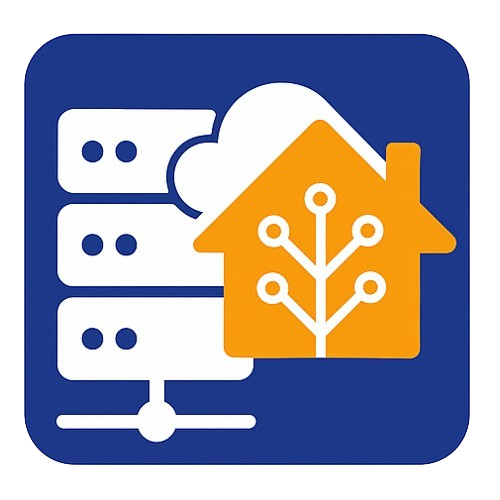

# DataCenter Assistant

[](https://github.com/kian2929/DataCenter-Assistant/releases)
[](https://github.com/custom-components/hacs)
[](https://opensource.org/licenses/MIT)

A custom Home Assistant integration for monitoring and managing VMware Cloud Foundation (VCF) environments. This integration provides comprehensive monitoring of VCF domains, including update status, resource utilization, and automated upgrade workflows.

## Project Background

This automation integration was developed as a **proof of concept** for a project offered by **EnBW** and undertaken by students of **Hochschule Karlsruhe**.



## Features

### 🔍 Monitoring & Status
- **Domain Status Monitoring**: Track all VCF domains with real-time update status
- **Resource Utilization**: Monitor CPU, memory, and storage usage across domains, clusters, and hosts
- **Connection Status**: Binary sensor for VCF connectivity with intelligent state preservation during upgrades
- **Update Availability**: Automatic detection of available VCF updates across all domains

### 🚀 Upgrade Management
- **Automated Upgrade Workflows**: Complete end-to-end VCF upgrade automation
- **Domain-specific Upgrade Buttons**: Start upgrades for individual domains
- **Upgrade Status Tracking**: Real-time status updates during upgrade processes
- **Upgrade Logs**: Detailed markdown-formatted logs for dashboard integration
- **Alert Acknowledgment**: Interactive buttons to acknowledge alerts during upgrades

### 📊 Entities Created

#### Sensors
- `VCF Overall Status` - System-wide status overview
- `VCF Active Domains Count` - Number of active domains
- `VCF [Domain] Status` - Per-domain update status
- `VCF [Domain] CPU/Memory/Storage` - Resource utilization sensors
- `VCF [Domain] [Cluster] host count` - Host count per cluster
- `VCF [Domain] Upgrade Status` - Upgrade workflow status
- `VCF [Domain] Upgrade Logs` - Markdown logs for dashboards

#### Binary Sensors
- `VCF Connection` - Connectivity status with smart state preservation
- `VCF Updates Available` - Global update availability indicator

#### Buttons
- `VCF Manual Update Check` - Force refresh of update status
- `VCF Refresh Token` - Manually refresh authentication token
- `VCF [Domain] Start Upgrade` - Initiate domain upgrade workflow
- `VCF [Domain] Acknowledge Alerts` - Acknowledge upgrade alerts

### 🔧 Services
- `refresh_token` - Refresh VCF authentication token
- `trigger_upgrade` - Trigger component-specific upgrades
- `download_bundle` - Download specific VCF bundles
- `start_domain_upgrade` - Start complete domain upgrade workflow
- `acknowledge_upgrade_alerts` - Acknowledge alerts during upgrades

## Installation

### HACS (Recommended)

1. Open HACS in your Home Assistant instance
2. Click on "Integrations"
3. Click the three dots menu and select "Custom repositories"
4. Add the repository URL: `https://github.com/kian2929/DataCenter-Assistant`
5. Select "Integration" as the category
6. Click "Add"
7. Search for "DataCenter Assistant" and install

### Manual Installation

1. Download the latest release from the [releases page](https://github.com/kian2929/DataCenter-Assistant/releases)
2. Extract the `custom_components/datacenter_assistant` folder to your Home Assistant `custom_components` directory
3. Restart Home Assistant

## Initial Setup

1. Go to **Settings** → **Devices & Services**
2. Click **Add Integration**
3. Search for "DataCenter Assistant"
4. Enter your VCF connection details:
   - **VCF URL**: Your SDDC Manager URL (e.g., `https://sddc-manager.example.com`)
   - **VCF Username**: Username for VCF API access
   - **VCF Password**: Password for VCF API access

### Upgrade Workflow

The integration provides a complete automated upgrade workflow:

1. **Check for Updates**: Automatically detects available updates
2. **Target Version**: Sets the target VCF version for upgrade
3. **Download Bundles**: Downloads required upgrade bundles
4. **Pre-checks**: Runs validation checks before upgrade
5. **Component Upgrades**: Sequentially upgrades SDDC Manager, NSX, vCenter, and ESXi
6. **Final Validation**: Validates successful upgrade completion

Monitor the upgrade process through:
- `sensor.vcf_[domain]_upgrade_status` - Current upgrade step
- `sensor.vcf_[domain]_upgrade_logs` - Detailed progress logs

## Important Implementation Notes

### Fixed Request Bodies for Component Upgrades

⚠️ **Note on API Implementation**: The request bodies used during component upgrade initiation are **fixed/hard-coded** and designed to function with our specific use case scenario (nested lab setup). While the VMware Cloud Foundation API provides extensive configuration options for upgrade operations (as documented in the API reference), implementing a complete functionality that would allow users to configure all these parameters from Home Assistant is **not realistic** and **out of scope** for this integration.

The current implementation uses simplified, pre-configured request bodies that cover the most common upgrade scenarios.

### Expected Upgrade Behavior

> **⚠️ Note**: ESX host and cluster upgrade functionality is not yet implemented. The upgrade workflow currently supports SDDC Manager, NSX, and vCenter components. As a result, a VCF upgrade will never succeed in this version of the integration. **It is expected to fail, and this is acknowledged.**

## Debug Logging

Enable debug logging for troubleshooting:

```yaml
logger:
  default: warning
  logs:
    custom_components.datacenter_assistant: debug
```

## Development

### Project Structure

```
custom_components/datacenter_assistant/
├── __init__.py             # Integration initialization
├── config_flow.py          # Configuration flow
├── coordinator.py          # Data update coordinator
├── vcf_api.py              # VCF API client
├── upgrade_service.py      # Upgrade workflow service
├── entity_factory.py       # Sensor entity factory
├── base_sensors.py         # Base sensor classes
├── sensor.py               # Sensor platform
├── binary_sensor.py        # Binary sensor platform
├── button.py               # Button platform
├── services.yaml           # Service definitions
├── utils.py                # Utility functions
├── manifest.json           # Integration manifest
└── translations/           # Localization files
    ├── en.json
    └── de.json
```

## Development Notes

This integration was implemented with the assistance of AI tools (Claude Sonnet 4 Preview via GitHub Agent mode). The workflow design, conceptual framework, and prompt preparation were thoroughly done manually before implementation, which was the crucial step for the realization of the project.

## License

This project is licensed under the MIT License - see the [LICENSE](LICENSE) file for details.
